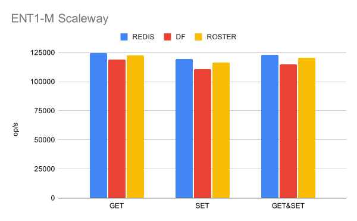

# roster

    

> Replacement of Redis with Rust & io-uring

`roster` is an in-memory data store which is aiming to provide a fully
comptabile redis APIs.

It is more like an expirement right now on, feel free to contribute. Some of the
initial code involving the resp protocol comes from `mini-redis`.

The current work is to have a good fundation to be able to build the Redis
Protocol on top of it.

## Benchmarks
If you want some benchmarks, feel free to check on:
[benchmarks](./docs/benchmarks.md);

The redis APIs are not properly implemented and only some basics things are
present so those benchmarks are only to check that the decisions made for the
storage & the I/O are good.

Those will be updated as implementations progress.

Benchmarks are made between Redis, Dragonfly & Roster.

### ENT1-M Scaleway

First benchmarks are based on an ENT1-M Scaleway which is a decent instance but
not a really big one and we are limited a lot by the instance and the network
between our two instances, as for Redis & Dragonfly.

- 16 vCPUS
- RAM: 64G
- BW: 3,2 Gbps 

    

## Protocol

### Reddis

- Only the RESP3 is wanted for now.

## Architecture

### Performance

To be able to max out performances out of an application we must be able to have
a linear-scalability.[^1] Usual issues around scalability are when you share
data between threads, (like false-sharing[^3]). 

To solve this issue we use an
[scc::Hashmap](https://github.com/wvwwvwwv/scalable-concurrent-containers#HashMap)
which is a really efficient datastructure. This datastructure can be shared
across multiple thread without having a loss in performance expect when have too
many thread. When this happens, we'll partition the storage by load-balancing
TCP connection on those threads when there is a need to.

We also use a runtime which is based on `io-uring` to handle every I/O on the
application: [monoio](https://github.com/bytedance/monoio/).

[^1]: It means if we have an application running 100 op/s on one thread, if we 
add another one, we should be at 200 op/s. We have a linear scalability. (or
a near linear scalability).
[^3]: An excellent article explaining it: [alic.dev](https://alic.dev/blog/false-sharing).

In the same spirit as a shared nothing architecture we use one thread per core
to maximize ressources available on the hardware.

"*Application tail latency is critical for services to meet their latency 
expectations. We have shown that the thread-per-core approach can reduce 
application tail latency of a key-value store by up to 71% compared to baseline 
Memcached running on commodity hardware and Linux.*"[^2]

[^2]: [The Impact of Thread-Per-Core Architecture on Application Tail Latency](https://helda.helsinki.fi/server/api/core/bitstreams/3142abaa-16e3-4ad0-beee-e62add589fc4/content)

### Storage

For the storage, instead of having each thread handling his part of the storage
with a load balancing based on TCP connection, it seems it's more efficient to
have a storage shared between a number of threads.

We split the whole application into a number of Storage Segment which are shared
between a fixed number of thread.

    

We do not use one use one
[scc::Hashmap](https://github.com/wvwwvwwv/scalable-concurrent-containers#HashMap)
per thread because it's more efficient than to shard the storage by thread and
load balance the TCP connections.

## References

- [RESP3](https://github.com/redis/redis-specifications/blob/master/protocol/RESP3.md)
- https://github.com/tair-opensource/compatibility-test-suite-for-redis
- https://github.com/redis/redis-specifications
- https://github.com/redis/redis-benchmarks-specification

## License
